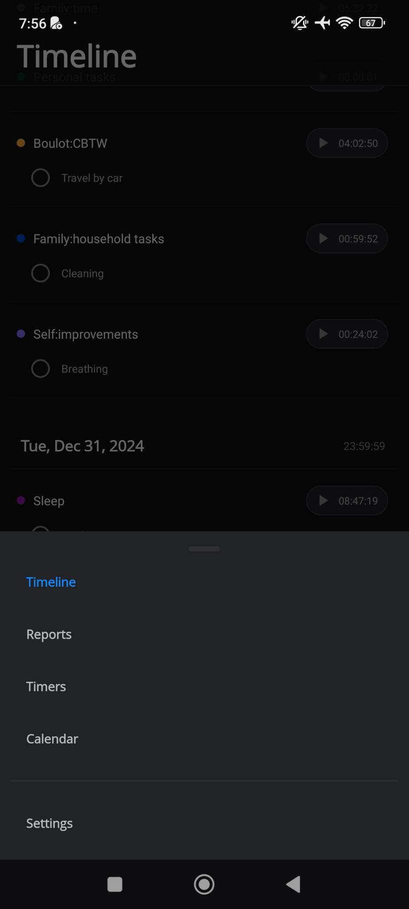

# Bottom Menu Modal

It contains a link to:

- [ ] the [Timeline Screen](timeline-screen.md)
- [ ] the [Reports Screen](reports-screen.md)
- [ ] the [Timers Screen](timers-screen.md)
- [ ] the [Calendar Screen](calendar-screen.md)
- [ ] After a separator, the [Settings Screen](settings-screen.md)
