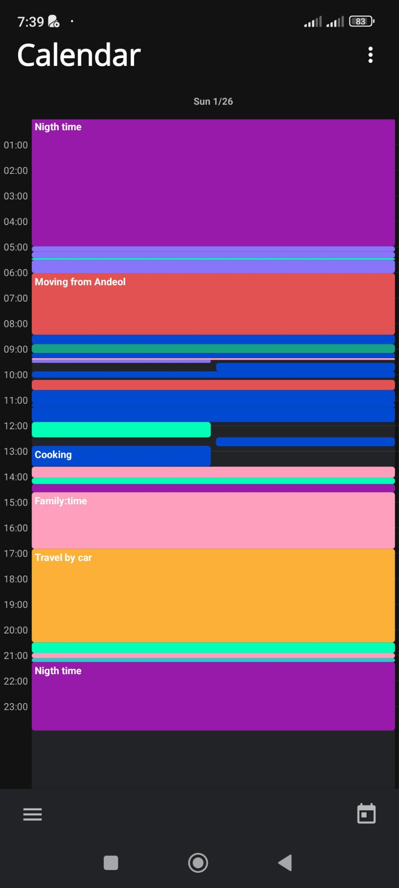

# Description Of a Day column

- [] The column title is the date with
  - Day of the week en letters,
  - Day value,
  - Month value in digits
- [] The records are displayed in blocks of time in the project's color to which the record is linked.
- [] If the record is linked to a task, we get the related project's informations to retrieve the color.
- [] If records have overlapping times, then the records are displayed in X columms per overlapping records.
  - Overlapping occurs when the start time of a record is before the end time of the previous record.
    
