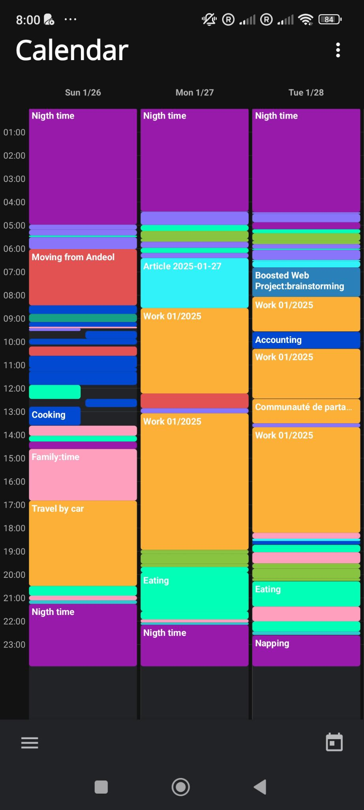
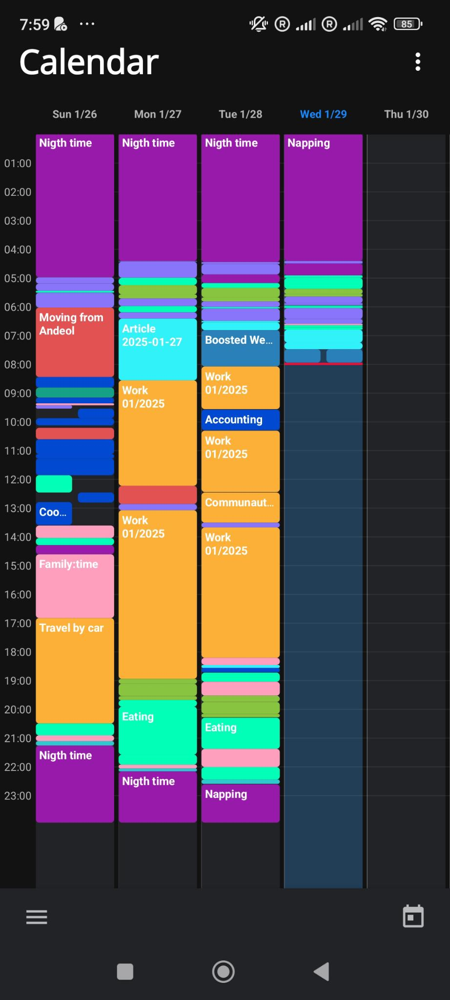

# Calendar Screen

The calendar screen has:

- [] A title "Calendar" at the top left
- [] A vertical three dot menu at the top right that bring up the [Calendar view options modal](calendar-view-options-modal.md)
- [] A fixed column for the time of the day, by increment of 1 hour
- [] A number of columms matching the selection in the [Calendar view options modal](calendar-view-options-modal.md).
