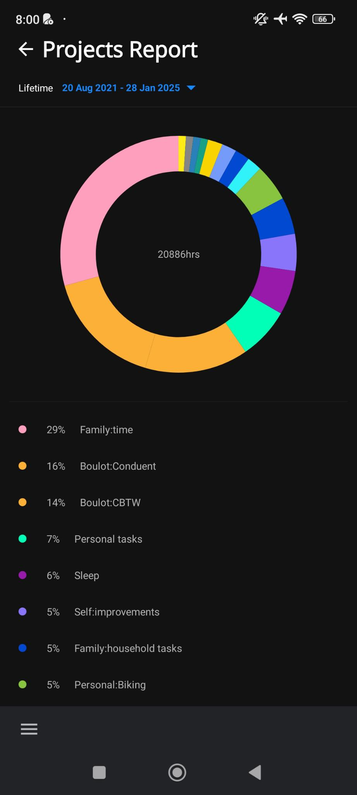

# Specifications

## Screens

### Timeline Screen

- [] List all the records in chronological order with a grouping by date.
  - [] Grouping label is made of:
    - the day of the week in letters,
    - the day of the month,
    - the month in letters,
    - the year if the record's year is different from the current year.
- For each record not being tracked:
  - [] the project name in bold letters preceeded by a small circle of the project's color on its left
  - [] the task name is preceeded by a circle checkbox, empty if task is not completed, checked otherwise,
  - [] the time tracked,
  - [] the ability to start that task once again,
  - [] the ability to complete the task, if the record is linked to a task. It is not the case for a project.
- For a ongoing tracking,

  - [] A box with a background as a gradient based on the project's color.
  - [] the project name in bold letters
  - [] the task name is preceeded by a circle checkbox, empty if task is not completed, checked otherwise,
  - [] the time elapsed since start of tracking,
  - [] the ability to stop the record.
  - [] Tapping on the record being tracked, it brings the project's screen with task and or the project itself above a "Stop task" button.

  

  - [] Tapping on the current tracked record in "Today" section brings the [Record Being Tracked Screen](#editing-a-record-being-tracked).

  - [] Tapping on any past tracked record brings the [Record Not Tracked Screen](#editing-a-record-not-being-tracked).

- [] The list is grouped by date in chronological order.
- [] The top item is the current tracking.
- [] At the bottom, we have:
  - [] On the left side, a sandwitch menu icon. Clicking it brings up the [Bottom Menu Modal](#bottom-menu-modal).
  - [] In the center, a button "Projects". See the [Project Selection Modal](#project-selection-modal).

### Project Selection Modal

When clicking the button "Projects" on the [Timeline screen](#timeline-screen), we have the list of projects displayed.

- [] The title is "Projects".
- [] Next, we have a "Add new project" button. See [New Project Screen](#new-project-screen).
- [] A tooltip text to indicate that tasks are available with a swipe gesture.
- [] The list of projects with:
  - [] The project color,
  - [] The project name,
  - [] A button to start a record for the project
  - [] The ability to swipe left or right to display the list of tasks for the selected project.

### New Project Screen

When clicking the button "+ Add New Project" on the [Project Selection Modal](#project-selection-modal), we have:

- [] an input to set the project name.
- [] a list of colors to pick from to set the project color.
- [] a back button with an arrow icon on the top left of the screen
  - [] The back button goes back to the [Timeline Screen](#timeline-screen).
- [] a "Save" button on the top right of the screen once at least one caracter is typed in the input field.
  - [] The default color is the first in the list.
  - [] Clicking "Save" goes back to the [Projects Screen](#timeline-screen).
    - I think it'd make sense to go to the project itself.
    - In fact, when I create a project, it means that I want to use it or create tasks for it.
    - Maybe, a modal with the following choices would be nice:
      - Go back to Projects
      - Go to {{ project_name }} (see [Project Screen](#project-screen))
      - Add a task to {{ project_name }}

Here is the color palette.

### Project Screen

When on the [Project Selection Modal](#project-selection-modal) from the [Timeline Screen](#timeline-screen), selecting a project brings us to that project.

When on the [Project Selection Modal](#project-selection-modal) from the [Edit A Record Screen](#edit-record-screen), after selecting the "Back" button on the [Select A Task Modal](#select-a-task-modal), selecting a project brings us to the edited record and updates the record to be linked to the selected project.

The elements of the screen are:

- On top:
  - [] A "back" button to go back to the [Timeline Screen](#timeline-screen).
  - [] The project name as title
  - [] A "three-dot" menu to bring the [Project Edit Modal](#project-edit-modal)
- On the middle, the content of selected tab for :
  - [the Records tab](#on-the-records-tab)
  - [the Tasks tab](#on-the-tasks-tab)
  - [the Stats tab](#on-the-statistics-tab)
- On the bottom:
  - [] Three tabs are the button that will show the records of the project, the tasks and the statistics.

#### On the Records Tab

- [] A button "Start project" to start a record for the project
- [] A button "New record" to add a record manually. See [Add New Record Screen](#add-new-record-screen).
- [] A list of records for the project and projects's tasks.
  - [] The records are listed from most recent to oldest.
  - [] When selecting a record, you see the [Edit Record Screen](#edit-record-screen).

#### On the Tasks Tab

- [] A button "+ Add new task" open a modal. See [Add new task modal](#add-new-task-modal).
- [] A list of tasks with, per task,
  - [] A round check box when the task isn't completed
  - [] A checked round check box when the task is completed
  - [] The task name
  - [] A button to start a record for the task.
    - [] The button text contains the total tracked time tracking the task.
- [] Selecting the task on its name brings the [Edit a task modal](#edit-a-task-modal).

#### On the Statistics Tab

Selecting the tab bring us to [a new screen](#statistics-screen).

#### Project Edit Modal

The modal's title is "Options"

And we have:

- [] A button "Edit"
  - Clicking it brings up the [New Project Screen](#new-project-screen) with the project's color and name prefilled.
- [] A button "New record"
  - Clicking it brings up the [New Record Screen](#add-new-record-screen)
- [] A button "New task"
  - Clicking it brings up the [New Task Modal](#add-new-task-modal)
- [] A button "Archive"
  - Clicking it archives the project. On the [Project Screen](#project-screen), the title is preceeded by "Archived".
- [] A button "Delete"
  - It is greyed out if the project isn't archived
  - Clicking it brings a modal asking to confirm deletion. See more about it [here](#project-delete-modal)

#### Project Delete modal

The modal allows to:

- [] to click a button "Cancel" the deletion. Clicking it brings us back the default project's screen tab.
- [] to click a button "Delete" the project. Clicking it brings us back the [timeline screen](#timeline-screen).
- [] to click a button "Merge".
  - Clicking it brings us [the project selection modal](#project-selection-modal).
  - The [Project Selection Modal](#project-selection-modal) title changes to "Select project".
  - After project selection,
  - [] all records and tasks are moved to the selected project.
  - [] the source project is deleted.
  - [] we are brought back to the [Timeline Screen](#timeline-screen).

### Statistics Screen

This describes in details the statistics screen, displayed when selecting [statistics tab](#on-the-statistics-tab) on the [the project screen](#project-screen).

#### Layout of Statistics Screen

We have:

- A top
  - [] A "Back" button to go back to the previous screen (either tab selected on the project)
  - [] The project's name and color (as a tiny circle) on top centered
- A tab content depending on the tab selected. See below.
- A set of three tabs:
  - [] ["Duration per period" tab](#duration-per-period-tab)
  - [] ["Activity per day" tab](#activity-per-day-tab)
  - [] ["Duration stats" tab](#duration-stats-tab)

#### Duration per period Tab

The tab is made of:

- A top menu with, on the same line,
  - [] A label "Duration per"
  - [] A button "Day" selected by default in the project's color (selected).
  - [] A button "Week" in the color dark color (unselected). Selecting it will change it color to the project's color and the "Day" button becomes unselected.
- A chart title section with
  - [] The selected day on the chart
  - [] The tracked time for the select day in "HH:mm:ss" format
  - [] The day and tracked time get updated when changing selection on the chart
- A [Line Chart](https://www.chartjs.org/docs/latest/samples/line/line.html) (using [Vue chart.js](https://vue-chartjs.org/examples/)) with
  - [] The possibility to select a day to update the chart title section.
  - [] A vertical thin line indicating the date selected.
- [] A period selection with the values:
  - last 7 days (7D),
  - last 1 month (1M),
  - last 3 months (3M),
  - last 6 months (6M),
  - last 1 year (1Y).

#### Activity per day Tab

The tab is made of:

- [] A text paragraph indicating the day of the week where records happened the most.
- [] A [Bar Chart](https://www.chartjs.org/docs/latest/samples/line/line.html) (using [Vue chart.js](https://vue-chartjs.org/examples/)) with abar for each day of the week and the **percentage per day** of the **total tracked time** on the project.

#### Duration stats Tab

The tab is made of:

- [] A paragraph line with "Project duration"
- [] The total tracked time of the project
  - [] The time is formatted "HH:mm:ss"
- [] A three-columms line with:
  - The number of tasks on the project
  - The number of opened tasks on the project
  - The number of closed tasks on the project

### Add New Task Modal

The modal includes:

- [] The project's name, with a tiny circle in its color on its left.
- [] An input to enter the task name with a placeholder "New task".
- [] A "Save" button
  - [] The task name is required to add the task
- [] Tapping or clicking outside the modal closes it.
- [] When coming from the [Select A Task Modal](#select-a-task-modal), we go back to that modal
- [] When coming from the [Tasks tab](#on-the-tasks-tab) of [the Project Screen](#project-screen), we go back to the Tasks tab.

### Edit a Task Modal

The modal includes:

- [] The project's name and color (as a tiny circle).
- [] An input to modify the current task name.
- [] A "Save" button
  - [] The task name is required to add the task
- [] Tapping or clicking outside the modal closes it.

### Add New Record Screen

I never used this. But the screen is very similar in functionality to the [Edit Record Not Being Tracked Screen](#editing-a-record-not-being-tracked).

### Edit Record Screen

#### Editing a record being tracked

You can:

- [] On top, select a completely different task throught the [Select A Task Modal](#select-a-task-modal)

  - If the record was modified, clicking the "Back" button or the browser back will show a modal to confirm if we want to discard the changes or keep editing.

  

- [] Edit the date and start time
  - [] Rule: The start date and time must be greater than the current time.
- [] A "Save" button at the bottom to save the record's modifications.

#### Editing a record not being tracked

You can:

- [] On the top of the screen, use the "Back" button on left or "Delete" button on the right.

  - If the record was modified, clicking the "Back" button or the browser back will show a modal to confirm if we want to discard the changes or keep editing.

  

- [] Next, select a completely different task or project throught the [Select A Task Or Project Modal](#project-selection-modal)
  - A change of task or project doesn't save the selection until you press the "Save" button.
- [] The tracked time is displayed in large letters and centered.
- [] Edit the date, start time and end time
- [] A "Save" button at the bottom to save the record's modifications.

- [] Edit the record as a multi-day record, e.g. the records starts on day N time X and ends on day N+1 time Y.
  - [] Rule: The start date and time must be greater than the end date and time.

### Tasks Screen

To analyze.

### Select A Task Modal

When coming from the [Record Screen](#edit-record-screen),

- [] The project's name and color (as a tiny circle on its left).
  - On the left, a "Back" button to display the [Project Selection Modal](#project-selection-modal)
- [] A button "+ Add a new task"
- [] A list of tasks:
  - without the total tracked time
  - with the uncheck/checked circle box for indicating ongoing or completed tasks.
- [] Selecting a different task updates the record-assigned task and brings us back to the [Record Screen](#edit-record-screen)

When coming from the [Project Selection Modal](#project-selection-modal), itself from the [Timeline Screen](#timeline-screen),

- [] The project's name and color (as a tiny circle on its left).
  - On the left, a "Back" button to display the [Project Selection Modal](#project-selection-modal)
- [] A button "+ Add a new task" to bring the [Add A New Task Modal](#add-new-task-modal).
- [] A list of tasks:
  - with the uncheck/checked circle box for indicating ongoing or completed tasks.
  - with the total tracked time inside a button that can start a new record for the task. Clicking one of those brings us back to the [Timeline Screen](#timeline-screen).

### Bottom Menu Modal

It contains a link to:

- [] the [Timeline Screen](#timeline-screen)
- [] the [Reports Screen](#reports-screen)
- [] the [Timers Screen](#timers-screen)
- [] the [Calendar Screen](#calendar-screen)
- [] After a separator, the [Settings Screen](#settings-screen)

### Settings Screen

To analyze.

### Calendar Screen

To analyze.

### Reports Screen

#### Default Screen

We have:

- [] At the top, a button untitled "Lifetime" with the time range with the date of the first record to the last record.

  - Selecting it brings a date range picker with predefined options (Today, Last 7 days, Last 30 days, Last 180 days, Last 365 days, Lifetime) or you can select a "From" date and a "To" date.

  

- [] An average daily tracked duration calculated on the tine range selected.
- [] A column bar chart section under the title "Duration per [*scale*] with

  - The portion of the tracked time per project with the project color
  - The X scale differs from the time range selected:
    - For Today, Last 7 days, Last 30 days or a custom time range greater than 30 days, the scale is a day.
    - For Last 180 days or a custom time range between 31 days and 180 days, the scale is a week.
    - For Last 365 days, Lifetime or a custom time range greater than 181 days, the scale is a month.
  - Clicking the chart brings us to [Reports Duration Screen](#reports-duration-screen)

- [] Then, we have a pie chart section under the title "Projects" with
  - the total tracked time
  - the portion of the tracked time per project with the project color
  - Clicking the chart brings us to [Reports Projects Screen](#reports-projects-screen)
- [] Finally, the total number of projects and tasks is displayed

### Reports Duration Screen

- [] The top menu allow to go back to the [Reports Default Screen](#reports-screen).
- [] Then, you can select a different time range.
- [] The time range is exactly the same as the [Reports Default Screen](#reports-screen).

  

- [] Below the column bar chart, a list of items per scale depending on the time range selected is displayed.
- [] Selecting an item on the chart will list the total tracked time, project per project, for the selected time range (a given day, week or month) and darken the column selected.

  

### Reports Projects Screen

- [] The top menu allow to go back to the [Reports Default Screen](#reports-screen).
- [] Then, you can select a different time range.
- [] Then, the same pie chart as on [Reports Default Screen](#reports-screen) filtered by the selected time range is displayed.
- [] Finally, the percentage of time tracked per project is listed below the chart with, on the same line:
  - a tiny circle of the project's color,
  - the percentage value,
  - the project's name.
- [] Selecting a list item will highlight the pie chart portion.
  

### Timers Screen

It contains a Pomodoro and simple timers. It isn't something I use and it will integrated [in the website blocker](https://github.com/JeremieLitzler/website-blocker-extension).
