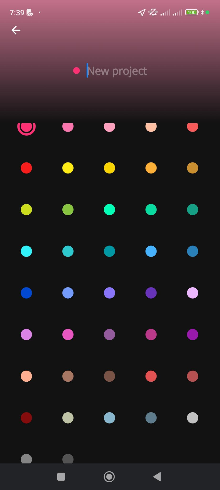

# Specifications

## Screens

### Timeline Screen

- [] List all the records in chronological order with, for each record:
  - [] the project name in bold letters
  - [] the task name,
  - [] the project color,
  - [] the time elapsed,
  - [] the ability to start that task once again,
  - [] the ability to comple the task, if the record is linked to a task. It is not the case for a project.
- [] The list is grouped by date in chronological order.
- [] The top item is the current tracking.
- [] At the bottom, we have:
  - [] On the left side, a sandwitch menu icon.
  - [] In the center, a button "Projects". See [screen "Projects"](#projects-screen).

### Projects Screen

When clicking the button "Projects" on the [Timeline screen](#timeline-screen), we have the list of projects displayed.

- [] The title is "Projects".
- [] Next, we have a "Add new project" button. See [New Project Screen](#new-project-screen).
- [] A tooltip text to indicate that tasks are available with a swipe gesture.
- [] The list of projects with:
  - [] The project color,
  - [] The project name,
  - [] A button to start a record for the project
  - [] The ability to swipe left or right to display the list of tasks for the selected project.

### New Project Screen

When clicking the button "+ Add New Project" on the [Projects screen](#projects-screen), we have:

- [] an input to set the project name.
- [] a list of colors to pick from to set the project color.
- [] a back button with an arrow icon on the top left of the screen
  - [] The back button goes back to the [Timeline Screen](#timeline-screen).
- [] a "Save" button on the top right of the screen once at least one caracter is typed in the input field.
  - [] The default color is the first in the list.
  - [] Clicking "Save" goes back to the [Projects Screen](#timeline-screen).
    - I think it'd make sense to go to the project itself.
    - In fact, when I create a project, it means that I want to use it or create tasks for it.
    - Maybe, a modal with the following choices would be nice:
      - Go back to Projects
      - Go to {{ project_name }} (see [Project Screen](#project-screen))
      - Add a task to {{ project_name }}

Here is the color palette.

### Project Screen

When on the [Projects Screen](#projects-screen), selecting a project brings us to that project.

The elements of the screen are:

- [] The project name as title
- [] Three tabs are the button that will show the records of the project, the tasks and the statistics.

#### On the Records Tab

- [] A button "Start project" to start a record for the project
- [] A button "New record" to add a record manually. See [Add New Record Screen](#add-new-record-screen).
- [] A list of records for the project and projects's tasks.

  - [] When selecting a record, you see the [Edit Record Screen](#edit-record-screen).

#### On the Tasks Tab

To analyze.

#### On the Statistics Tab

To analyze.

### Add New Record Screen

To analyze.

### Edit Record Screen

To analyze.

### Tasks Screen

To analyze.

### Settings Screen

To analyze.

### Calendar Screen

To analyze.

### Reports Screen

To analyze.

### Timers Screen

It contains a Pomodoro and simple timers. It isn't something I use and it will integrated [in the website blocker](https://github.com/JeremieLitzler/website-blocker-extension).
