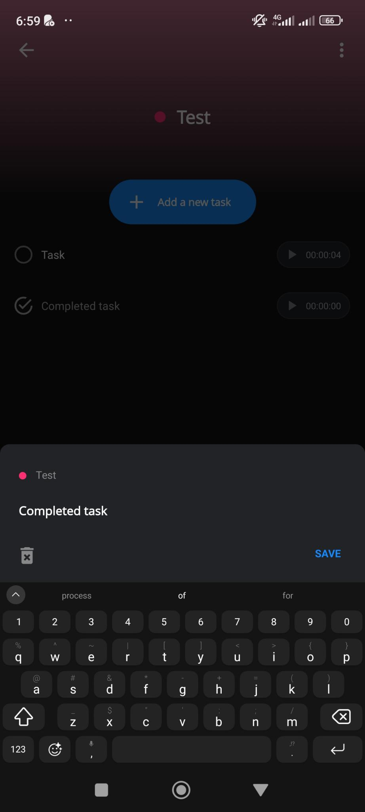

# Specifications

## Screens

### Timeline Screen

- [] List all the records in chronological order with, for each record:
  - [] the project name in bold letters
  - [] the task name,
  - [] the project color,
  - [] the time tracked,
  - [] the ability to start that task once again,
  - [] the ability to comple the task, if the record is linked to a task. It is not the case for a project.
- [] The list is grouped by date in chronological order.
- [] The top item is the current tracking.
- [] At the bottom, we have:
  - [] On the left side, a sandwitch menu icon.
  - [] In the center, a button "Projects". See the [Project Selection Modal](#project-selection-modal).

### Project Selection Modal

When clicking the button "Projects" on the [Timeline screen](#timeline-screen), we have the list of projects displayed.

- [] The title is "Projects".
- [] Next, we have a "Add new project" button. See [New Project Screen](#new-project-screen).
- [] A tooltip text to indicate that tasks are available with a swipe gesture.
- [] The list of projects with:
  - [] The project color,
  - [] The project name,
  - [] A button to start a record for the project
  - [] The ability to swipe left or right to display the list of tasks for the selected project.

### New Project Screen

When clicking the button "+ Add New Project" on the [Project Selection Modal](#project-selection-modal), we have:

- [] an input to set the project name.
- [] a list of colors to pick from to set the project color.
- [] a back button with an arrow icon on the top left of the screen
  - [] The back button goes back to the [Timeline Screen](#timeline-screen).
- [] a "Save" button on the top right of the screen once at least one caracter is typed in the input field.
  - [] The default color is the first in the list.
  - [] Clicking "Save" goes back to the [Projects Screen](#timeline-screen).
    - I think it'd make sense to go to the project itself.
    - In fact, when I create a project, it means that I want to use it or create tasks for it.
    - Maybe, a modal with the following choices would be nice:
      - Go back to Projects
      - Go to {{ project_name }} (see [Project Screen](#project-screen))
      - Add a task to {{ project_name }}

Here is the color palette.

### Project Screen

When on the [Project Selection Modal](#project-selection-modal), selecting a project brings us to that project.

The elements of the screen are:

- On top:
  - [] A "back" button to go back to the [Timeline Screen](#timeline-screen).
  - [] The project name as title
  - [] A "three-dot" menu to bring the [Project Edit Modal](#project-edit-modal)
- On the middle, the content of selected tab for :
  - [the Records tab](#on-the-records-tab)
  - [the Tasks tab](#on-the-tasks-tab)
  - [the Stats tab](#on-the-statistics-tab)
- On the bottom:
  - [] Three tabs are the button that will show the records of the project, the tasks and the statistics.

#### On the Records Tab

- [] A button "Start project" to start a record for the project
- [] A button "New record" to add a record manually. See [Add New Record Screen](#add-new-record-screen).
- [] A list of records for the project and projects's tasks.
  - [] The records are listed from most recent to oldest.
  - [] When selecting a record, you see the [Edit Record Screen](#edit-record-screen).

#### On the Tasks Tab

- [] A button "+ Add new task" open a modal. See [Add new task modal](#add-new-task-modal).
- [] A list of tasks with, per task,
  - [] A round check box when the task isn't completed
  - [] A checked round check box when the task is completed
  - [] The task name
  - [] A button to start a record for the task.
    - [] The button text contains the total tracked time tracking the task.
- [] Selecting the task on its name brings the [Edit a task modal](#edit-a-task-modal).

#### On the Statistics Tab

Selecting the tab bring us to [a new screen](#statistics-screen).

#### Project Edit Modal

The modal's title is "Options"

And we have:

- [] A button "Edit"
  - Clicking it brings up the [New Project Screen](#new-project-screen) with the project's color and name prefilled.
- [] A button "New record"
  - Clicking it brings up the [New Record Screen](#add-new-record-screen)
- [] A button "New task"
  - Clicking it brings up the [New Task Modal](#add-new-task-modal)
- [] A button "Archive"
  - Clicking it archives the project. On the [Project Screen](#project-screen), the title is preceeded by "Archived".
- [] A button "Delete"
  - It is greyed out if the project isn't archived
  - Clicking it brings a modal asking to confirm deletion. See more about it [here](#project-delete-modal)

#### Project Delete modal

The modal allows to:

- [] to click a button "Cancel" the deletion. Clicking it brings us back the default project's screen tab.
- [] to click a button "Delete" the project. Clicking it brings us back the [timeline screen](#timeline-screen).
- [] to click a button "Merge".
  - Clicking it brings us [the project selection modal](#project-selection-modal).
  - The [Project Selection Modal](#project-selection-modal) title changes to "Select project".
  - After project selection,
  - [] all records and tasks are moved to the selected project.
  - [] the source project is deleted.
  - [] we are brought back to the [Timeline Screen](#timeline-screen).

### Statistics Screen

This describes in details the statistics screen, displayed when selecting [statistics tab](#on-the-statistics-tab) on the [the project screen](#project-screen).

#### Layout of Statistics Screen

We have:

- A top
  - [] A "Back" button to go back to the previous screen (either tab selected on the project)
  - [] The project's name and color (as a tiny circle) on top centered
- A tab content depending on the tab selected. See below.
- A set of three tabs:
  - [] ["Duration per period" tab](#duration-per-period-tab)
  - [] ["Activity per day" tab](#activity-per-day-tab)
  - [] ["Duration stats" tab](#duration-stats-tab)

#### Duration per period Tab

The tab is made of:

- A top menu with, on the same line,
  - [] A label "Duration per"
  - [] A button "Day" selected by default in the project's color (selected).
  - [] A button "Week" in the color dark color (unselected). Selecting it will change it color to the project's color and the "Day" button becomes unselected.
- A chart title section with
  - [] The selected day on the chart
  - [] The tracked time for the select day in "HH:mm:ss" format
  - [] The day and tracked time get updated when changing selection on the chart
- A [Line Chart](https://www.chartjs.org/docs/latest/samples/line/line.html) (using [Vue chart.js](https://vue-chartjs.org/examples/)) with
  - [] The possibility to select a day to update the chart title section.
  - [] A vertical thin line indicating the date selected.
- [] A period selection with the values:
  - last 7 days (7D),
  - last 1 month (1M),
  - last 3 months (3M),
  - last 6 months (6M),
  - last 1 year (1Y).

#### Activity per day Tab

The tab is made of:

- [] A text paragraph indicating the day of the week where records happened the most.
- [] A [Bar Chart](https://www.chartjs.org/docs/latest/samples/line/line.html) (using [Vue chart.js](https://vue-chartjs.org/examples/)) with abar for each day of the week and the **percentage per day** of the **total tracked time** on the project.

#### Duration stats Tab

The tab is made of:

- [] A paragraph line with "Project duration"
- [] The total tracked time of the project
  - [] The time is formatted "HH:mm:ss"
- [] A three-columms line with:
  - The number of tasks on the project
  - The number of opened tasks on the project
  - The number of closed tasks on the project

### Add New Task Modal

The modal includes:

- [] The project's name and color (as a tiny circle).
- [] An input to enter the task name with a placeholder "New task".
- [] A "Save" button
  - [] The task name is required to add the task
- [] Tapping or clicking outside the modal closes it.

### Edit a Task Modal

The modal includes:

- [] The project's name and color (as a tiny circle).
- [] An input to modify the current task name.
- [] A "Save" button
  - [] The task name is required to add the task
- [] Tapping or clicking outside the modal closes it.

### Add New Record Screen

To analyze.

### Edit Record Screen

To analyze.

### Tasks Screen

To analyze.

### Settings Screen

To analyze.

### Calendar Screen

To analyze.

### Reports Screen

To analyze.

### Timers Screen

It contains a Pomodoro and simple timers. It isn't something I use and it will integrated [in the website blocker](https://github.com/JeremieLitzler/website-blocker-extension).
