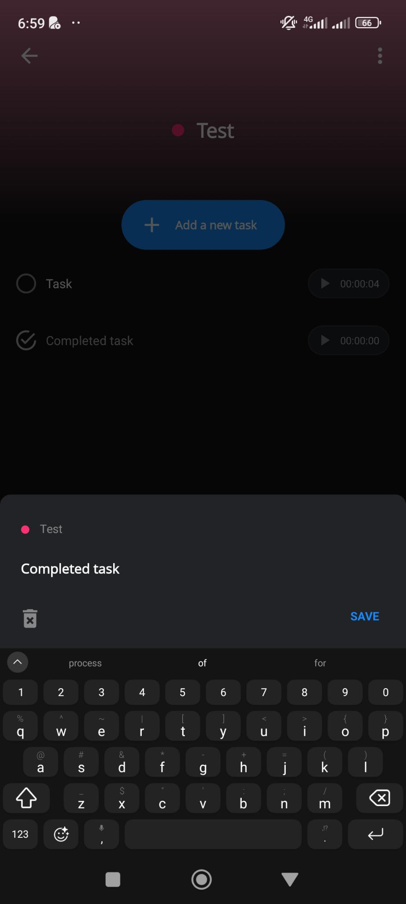

# Edit a Task Modal

The modal includes:

- [ ] The project's name and color (as a tiny circle).
- [ ] An input to modify the current task name.
- [ ] A "Save" button
  - [ ] The task name is required to add the task
- [ ] Tapping or clicking outside the modal closes it.
