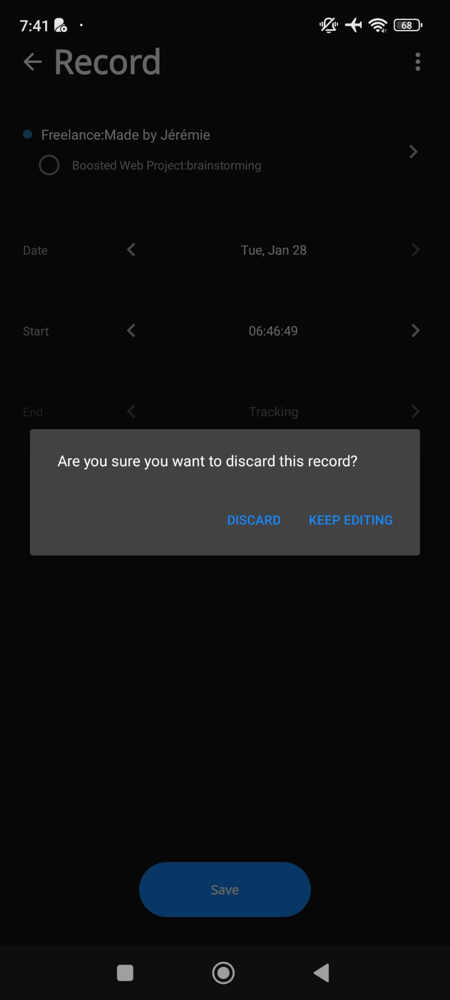

# Editing a record being tracked

You can:

- [ ] On top, select a completely different task throught the [Select A Task Modal](select-a-task-modal.md)

  - If the record was modified, clicking the "Back" button or the browser back will show a modal to confirm if we want to discard the changes or keep editing.

  

- [ ] Edit the date and start time
  - [ ] Rule: The start date and time must be greater than the current time.
- [ ] A "Save" button at the bottom to save the record's modifications.
