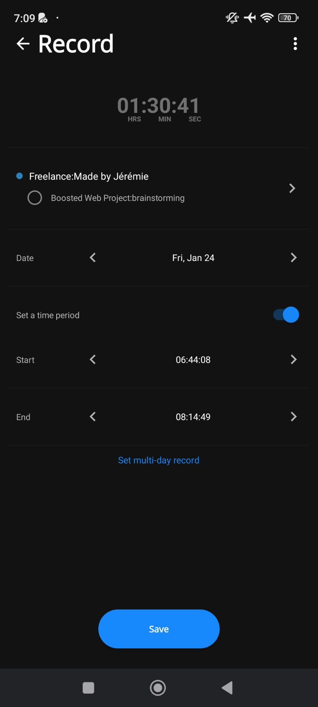

# Editing a record not being tracked

You can:

- [ ] On the top of the screen, use the "Back" button on left or "Delete" button on the right.

  - If the record was modified, clicking the "Back" button or the browser back will show a modal to confirm if we want to discard the changes or keep editing.

  

- [ ] Next, select a completely different task or project throught the [Select A Task Or Project Modal](project-selection-modal.md)
  - A change of task or project doesn't save the selection until you press the "Save" button.
- [ ] The tracked time is displayed in large letters and centered.
- [ ] Edit the date, start time and end time
- [ ] A "Save" button at the bottom to save the record's modifications.

- [ ] Edit the record as a multi-day record, e.g. the records starts on day N time X and ends on day N+1 time Y.
  - [ ] Rule: The start date and time must be greater than the end date and time.
