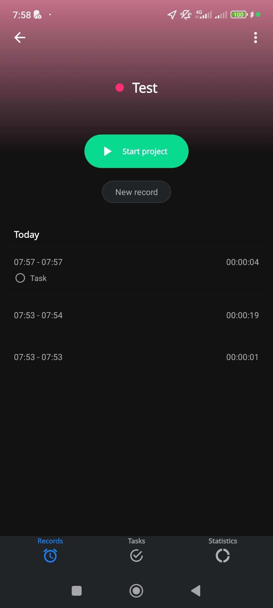

# On the Records Tab

- [ ] A button "Start project" to start a record for the project
- [ ] A button "New record" to add a record manually. See [Add New Record Screen](add-new-record-screen.md).
- [ ] A list of records for the project and projects's tasks.
  - [ ] The records are listed from most recent to oldest.
  - [ ] When selecting a record, you see the [Edit Record Screen](edit-record-screen.md).
