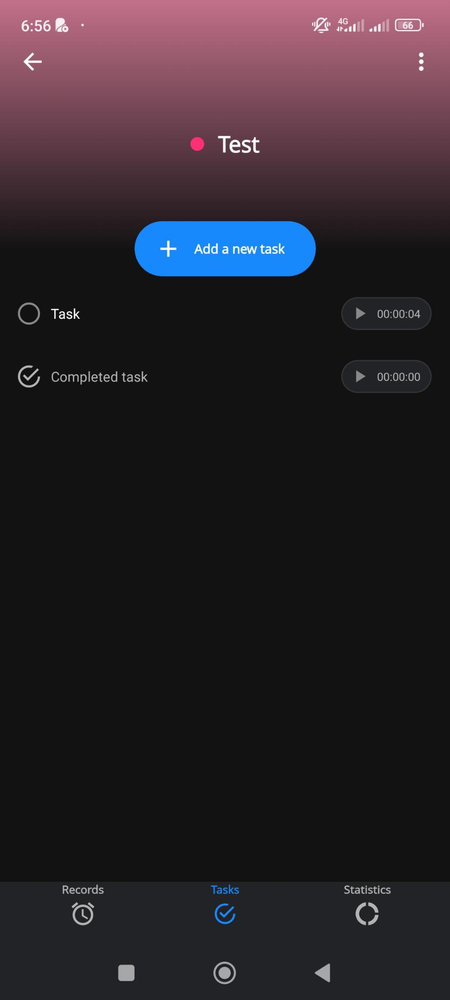

# On the Tasks Tab

- [ ] A button "+ Add new task" open a modal. See [Add new task modal](add-new-task-modal.md).
- [ ] A list of tasks with, per task,
  - [ ] A round check box when the task isn't completed
  - [ ] A checked round check box when the task is completed
  - [ ] The task name
  - [ ] A button to start a record for the task.
    - [ ] The button text contains the total tracked time tracking the task.
- [ ] Selecting the task on its name brings the [Edit a task modal](edit-a-task-modal.md).
