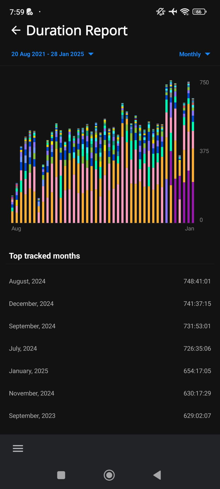

# Reports Duration Screen

- [ ] The top menu allow to go back to the [Reports Default Screen](reports-screen.md).
- [ ] Then, you can select a different time range.
- [ ] The time range is exactly the same as the [Reports Default Screen](reports-screen.md).

  

- [ ] Below the column bar chart, a list of items per scale depending on the time range selected is displayed.
- [ ] Selecting an item on the chart will list the total tracked time, project per project, for the selected time range (a given day, week or month) and darken the column selected.

  
