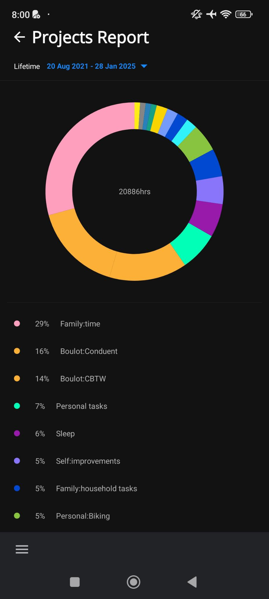
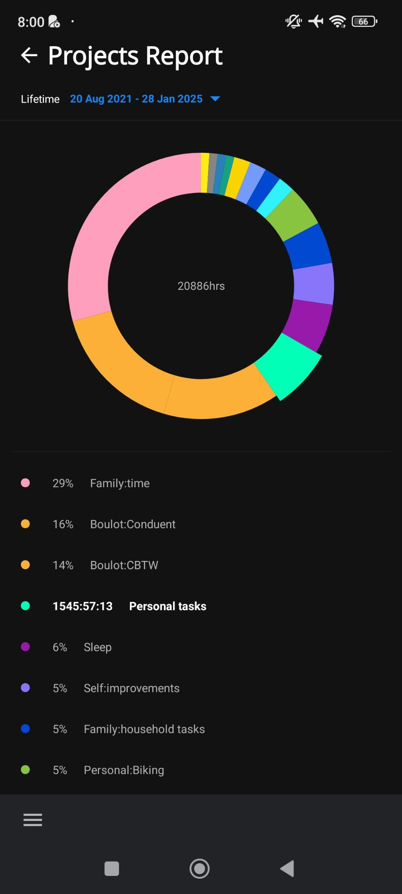

# Reports Projects Screen

- [ ] The top menu allow to go back to the [Reports Default Screen](reports-screen.md).
- [ ] Then, you can select a different time range.
- [ ] Then, the same pie chart as on [Reports Default Screen](reports-screen.md) filtered by the selected time range is displayed.
- [ ] Finally, the percentage of time tracked per project is listed below the chart with, on the same line:
  - a tiny circle of the project's color,
  - the percentage value,
  - the project's name.
- [ ] Selecting a list item will highlight the pie chart portion.
      
