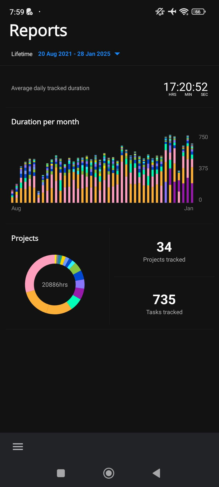

# Default Screen

We have:

- [ ] At the top, a button untitled "Lifetime" with the time range with the date of the first record to the last record.

  - Selecting it brings a date range picker with predefined options (Today, Last 7 days, Last 30 days, Last 180 days, Last 365 days, Lifetime) or you can select a "From" date and a "To" date.

  

- [ ] An average daily tracked duration calculated on the tine range selected.
- [ ] A column bar chart section under the title "Duration per [*scale*] with

  - The portion of the tracked time per project with the project color
  - The X scale differs from the time range selected:
    - For Today, Last 7 days, Last 30 days or a custom time range greater than 30 days, the scale is a day.
    - For Last 180 days or a custom time range between 31 days and 180 days, the scale is a week.
    - For Last 365 days, Lifetime or a custom time range greater than 181 days, the scale is a month.
  - Clicking the chart brings us to [Reports Duration Screen](reports-duration-screen.md)

- [ ] Then, we have a pie chart section under the title "Projects" with
  - the total tracked time
  - the portion of the tracked time per project with the project color
  - Clicking the chart brings us to [Reports Projects Screen](reports-projects-screen.md)
- [ ] Finally, the total number of projects and tasks is displayed
