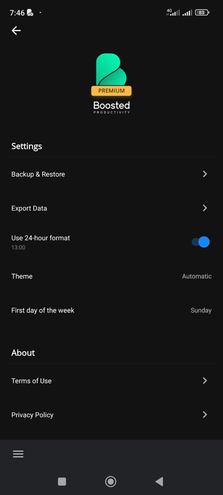
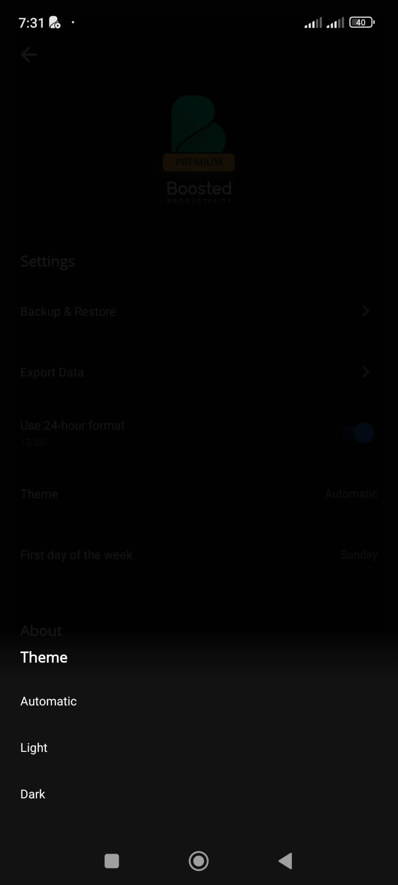

# The Settings Default Screen

We have:

- [] A logo on top
- [] A `h1` title "Settings" with a separator line
- [] A link to view [The Backup & Restore Screen](the-backup--restore-screen.md)
- [] A link to view [The Export Data Screen](the-export-data-screen.md)
- [] A toggle to choose the 24-hour time format or not
  - An example is displayed below in muted text
- [] A "button" to pick the theme to use either Automatic, Dark and Light theme in a modal
  
- [] A "button" to [pick the "First day of the week" in a modal](first-day-of-the-week-modal.md)
- [] A `h2` title "About" with a separator line
- [] A link to Terms of Use terms
- [] A link to Privacy Policy terms
