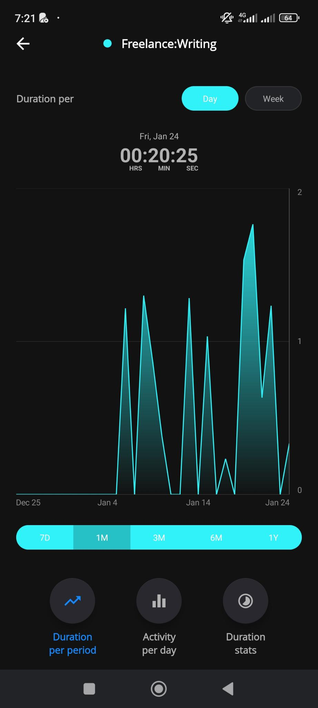

# Duration per period Tab

The tab is made of:

- A top menu with, on the same line,
  - [ ] A label "Duration per"
  - [ ] A button "Day" selected by default in the project's color (selected).
  - [ ] A button "Week" in the color dark color (unselected). Selecting it will change it color to the project's color and the "Day" button becomes unselected.
- A chart title section with
  - [ ] The selected day on the chart
  - [ ] The tracked time for the select day in "HH:mm:ss" format
  - [ ] The day and tracked time get updated when changing selection on the chart
- A [Line Chart](https://www.chartjs.org/docs/latest/samples/line/line.html) (using [Vue chart.js](https://vue-chartjs.org/examples/)) with
  - [ ] The possibility to select a day to update the chart title section.
  - [ ] A vertical thin line indicating the date selected.
- [ ] A period selection with the values:
  - last 7 days (7D),
  - last 1 month (1M),
  - last 3 months (3M),
  - last 6 months (6M),
  - last 1 year (1Y).
