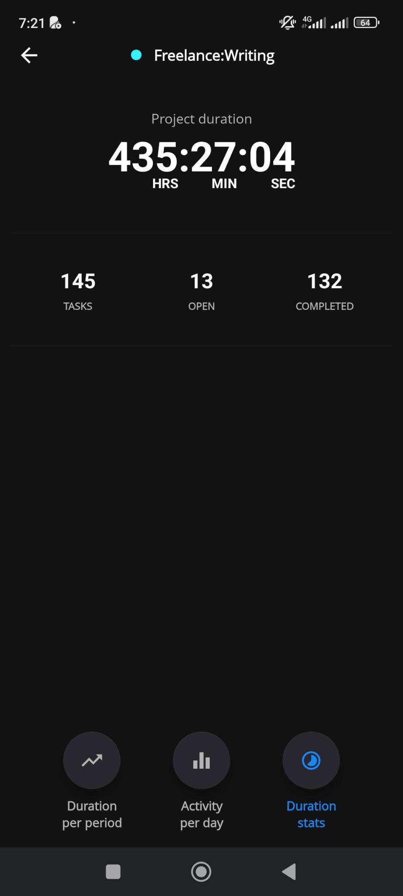
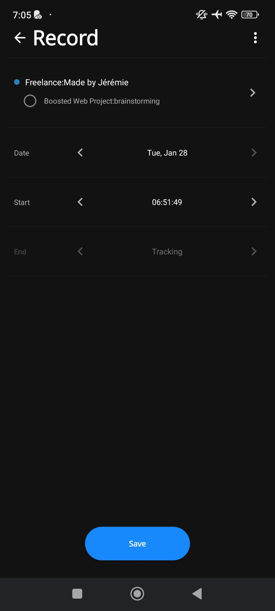
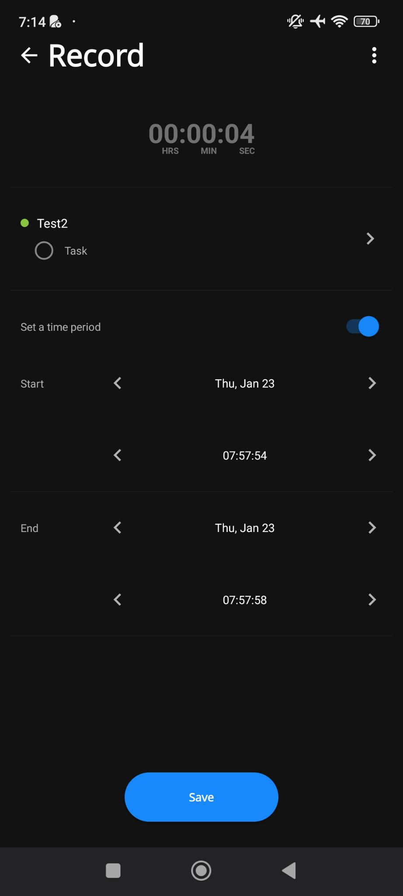
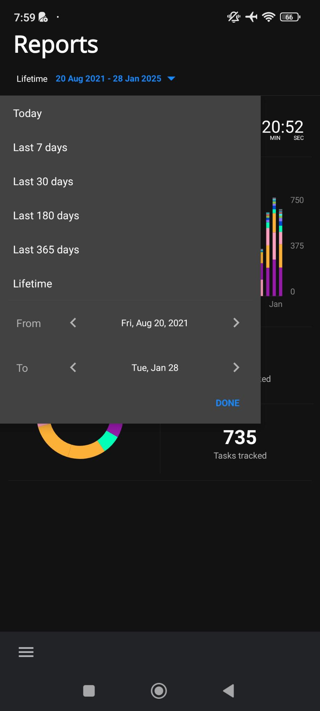
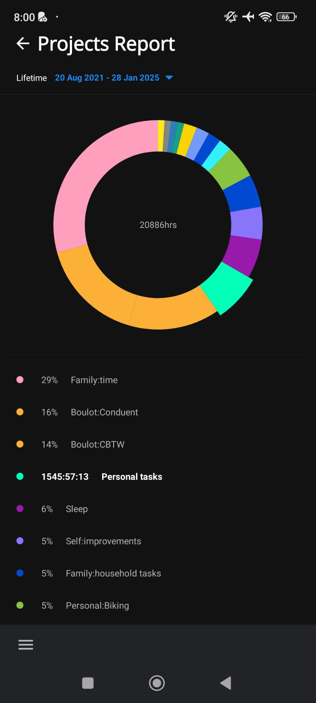

# Specifications

## Screens

### [Timeline Screen](timeline-screen.md)

### [Project Selection Modal](project-selection-modal.md)

### [New Project Screen](new-project-screen.md)

### [Project Screen](project-screen.md)

#### [On the Records Tab](project-screen-on-the-records-tab.md)

#### [On the Tasks Tab](project-screen-on-the-tasks-tab.md)

#### [On the Statistics Tab](project-screen-on-the-statistics-tab.md)

#### [Project Edit Modal](project-screen-edit-project-modal.md)

#### [Project Delete modal](project-delete-modal.md)

### [Statistics Screen](statistics-screen.md)

#### Layout of Statistics Screen

We have:

- A top
  - [ ] A "Back" button to go back to the previous screen (either tab selected on the project)
  - [ ] The project's name and color (as a tiny circle) on top centered
- A tab content depending on the tab selected. See below.
- A set of three tabs:
  - [ ] ["Duration per period" tab](#duration-per-period-tab)
  - [ ] ["Activity per day" tab](#activity-per-day-tab)
  - [ ] ["Duration stats" tab](#duration-stats-tab)

#### Duration per period Tab

The tab is made of:

- A top menu with, on the same line,
  - [ ] A label "Duration per"
  - [ ] A button "Day" selected by default in the project's color (selected).
  - [ ] A button "Week" in the color dark color (unselected). Selecting it will change it color to the project's color and the "Day" button becomes unselected.
- A chart title section with
  - [ ] The selected day on the chart
  - [ ] The tracked time for the select day in "HH:mm:ss" format
  - [ ] The day and tracked time get updated when changing selection on the chart
- A [Line Chart](https://www.chartjs.org/docs/latest/samples/line/line.html) (using [Vue chart.js](https://vue-chartjs.org/examples/)) with
  - [ ] The possibility to select a day to update the chart title section.
  - [ ] A vertical thin line indicating the date selected.
- [ ] A period selection with the values:
  - last 7 days (7D),
  - last 1 month (1M),
  - last 3 months (3M),
  - last 6 months (6M),
  - last 1 year (1Y).

#### Activity per day Tab

The tab is made of:

- [ ] A text paragraph indicating the day of the week where records happened the most.
- [ ] A [Bar Chart](https://www.chartjs.org/docs/latest/samples/line/line.html) (using [Vue chart.js](https://vue-chartjs.org/examples/)) with abar for each day of the week and the **percentage per day** of the **total tracked time** on the project.

#### Duration stats Tab

The tab is made of:

- [ ] A paragraph line with "Project duration"
- [ ] The total tracked time of the project
  - [ ] The time is formatted "HH:mm:ss"
- [ ] A three-columms line with:
  - The number of tasks on the project
  - The number of opened tasks on the project
  - The number of closed tasks on the project

### Add New Task Modal

The modal includes:

- [ ] The project's name, with a tiny circle in its color on its left.
- [ ] An input to enter the task name with a placeholder "New task".
- [ ] A "Save" button
  - [ ] The task name is required to add the task
- [ ] Tapping or clicking outside the modal closes it.
- [ ] When coming from the [Select A Task Modal](#select-a-task-modal), we go back to that modal
- [ ] When coming from the [Tasks tab](#on-the-tasks-tab) of [the Project Screen](#project-screen), we go back to the Tasks tab.

### Edit a Task Modal

The modal includes:

- [ ] The project's name and color (as a tiny circle).
- [ ] An input to modify the current task name.
- [ ] A "Save" button
  - [ ] The task name is required to add the task
- [ ] Tapping or clicking outside the modal closes it.

### Add New Record Screen

I never used this. But the screen is very similar in functionality to the [Edit Record Not Being Tracked Screen](#editing-a-record-not-being-tracked).

### Edit Record Screen

#### Editing a record being tracked

You can:

- [ ] On top, select a completely different task throught the [Select A Task Modal](#select-a-task-modal)

  - If the record was modified, clicking the "Back" button or the browser back will show a modal to confirm if we want to discard the changes or keep editing.

  

- [ ] Edit the date and start time
  - [ ] Rule: The start date and time must be greater than the current time.
- [ ] A "Save" button at the bottom to save the record's modifications.

#### Editing a record not being tracked

You can:

- [ ] On the top of the screen, use the "Back" button on left or "Delete" button on the right.

  - If the record was modified, clicking the "Back" button or the browser back will show a modal to confirm if we want to discard the changes or keep editing.

  

- [ ] Next, select a completely different task or project throught the [Select A Task Or Project Modal](#project-selection-modal)
  - A change of task or project doesn't save the selection until you press the "Save" button.
- [ ] The tracked time is displayed in large letters and centered.
- [ ] Edit the date, start time and end time
- [ ] A "Save" button at the bottom to save the record's modifications.

- [ ] Edit the record as a multi-day record, e.g. the records starts on day N time X and ends on day N+1 time Y.
  - [ ] Rule: The start date and time must be greater than the end date and time.

### Tasks Screen

To analyze.

### Select A Task Modal

When coming from the [Record Screen](#edit-record-screen),

- [ ] The project's name and color (as a tiny circle on its left).
  - On the left, a "Back" button to display the [Project Selection Modal](#project-selection-modal)
- [ ] A button "+ Add a new task"
- [ ] A list of tasks:
  - without the total tracked time
  - with the uncheck/checked circle box for indicating ongoing or completed tasks.
- [ ] Selecting a different task updates the record-assigned task and brings us back to the [Record Screen](#edit-record-screen)

When coming from the [Project Selection Modal](#project-selection-modal), itself from the [Timeline Screen](#timeline-screen),

- [ ] The project's name and color (as a tiny circle on its left).
  - On the left, a "Back" button to display the [Project Selection Modal](#project-selection-modal)
- [ ] A button "+ Add a new task" to bring the [Add A New Task Modal](#add-new-task-modal).
- [ ] A list of tasks:
  - with the uncheck/checked circle box for indicating ongoing or completed tasks.
  - with the total tracked time inside a button that can start a new record for the task. Clicking one of those brings us back to the [Timeline Screen](#timeline-screen).

### Bottom Menu Modal

It contains a link to:

- [ ] the [Timeline Screen](#timeline-screen)
- [ ] the [Reports Screen](#reports-screen)
- [ ] the [Timers Screen](#timers-screen)
- [ ] the [Calendar Screen](#calendar-screen)
- [ ] After a separator, the [Settings Screen](#settings-screen)

### Settings Screen

To analyze.

### Calendar Screen

To analyze.

### Reports Screen

#### Default Screen

We have:

- [ ] At the top, a button untitled "Lifetime" with the time range with the date of the first record to the last record.

  - Selecting it brings a date range picker with predefined options (Today, Last 7 days, Last 30 days, Last 180 days, Last 365 days, Lifetime) or you can select a "From" date and a "To" date.

  

- [ ] An average daily tracked duration calculated on the tine range selected.
- [ ] A column bar chart section under the title "Duration per [*scale*] with

  - The portion of the tracked time per project with the project color
  - The X scale differs from the time range selected:
    - For Today, Last 7 days, Last 30 days or a custom time range greater than 30 days, the scale is a day.
    - For Last 180 days or a custom time range between 31 days and 180 days, the scale is a week.
    - For Last 365 days, Lifetime or a custom time range greater than 181 days, the scale is a month.
  - Clicking the chart brings us to [Reports Duration Screen](#reports-duration-screen)

- [ ] Then, we have a pie chart section under the title "Projects" with
  - the total tracked time
  - the portion of the tracked time per project with the project color
  - Clicking the chart brings us to [Reports Projects Screen](#reports-projects-screen)
- [ ] Finally, the total number of projects and tasks is displayed

### Reports Duration Screen

- [ ] The top menu allow to go back to the [Reports Default Screen](#reports-screen).
- [ ] Then, you can select a different time range.
- [ ] The time range is exactly the same as the [Reports Default Screen](#reports-screen).

  

- [ ] Below the column bar chart, a list of items per scale depending on the time range selected is displayed.
- [ ] Selecting an item on the chart will list the total tracked time, project per project, for the selected time range (a given day, week or month) and darken the column selected.

  

### Reports Projects Screen

- [ ] The top menu allow to go back to the [Reports Default Screen](#reports-screen).
- [ ] Then, you can select a different time range.
- [ ] Then, the same pie chart as on [Reports Default Screen](#reports-screen) filtered by the selected time range is displayed.
- [ ] Finally, the percentage of time tracked per project is listed below the chart with, on the same line:
  - a tiny circle of the project's color,
  - the percentage value,
  - the project's name.
- [ ] Selecting a list item will highlight the pie chart portion.
      

### Timers Screen

It contains a Pomodoro and simple timers. It isn't something I use and it will integrated [in the website blocker](https://github.com/JeremieLitzler/website-blocker-extension).
