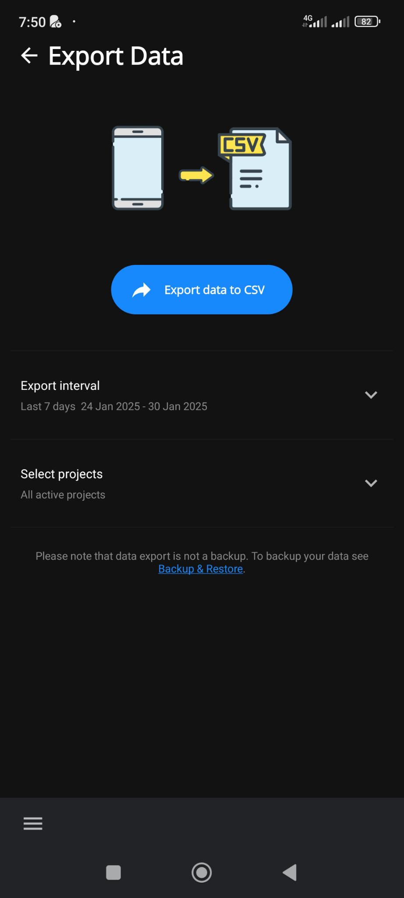

# The Export Data Screen

The screen is structured as follows:

- [] A image showing the export will save the data from the phone or computer to a CSV file.
- [] A button "Export data to CSV" that generates the export file.
- [] A button "Export interval" with in muted text the select interval
- [] A button "Select projects" with in muted text with only selected projects (includes the tiny coloured circle) or "All active projects"
