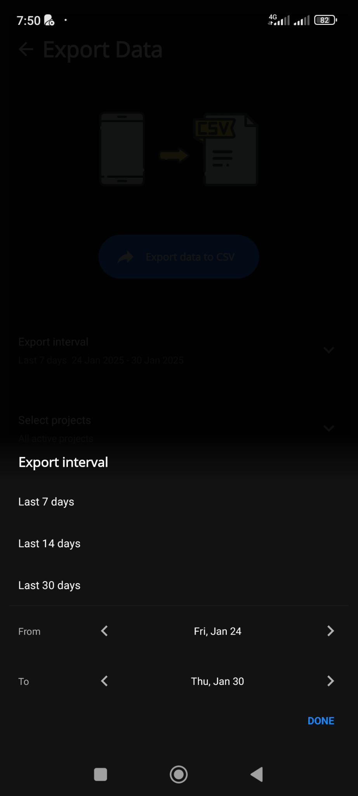

# The Export Interval Selection Modal

We have:

- [] A title "Export interval"
- [] 3 predefined intervals:
  - Last 7 days
  - Last 14 days
  - Last 30 days
  - I'd like to add the "Last calendar month" which I often use.
- [] After a separator line, we can define a custom interval with a "from" and "to" date.
  - The default "from" value is the date 7 days ago.
  - The default "to" value is yesterday.
  - On each input, you have:
    - a left arrow icon that decrement the date by one day
    - a right arrow icon that increment the date by one day
- [] A "DONE" allows to closes the modal
