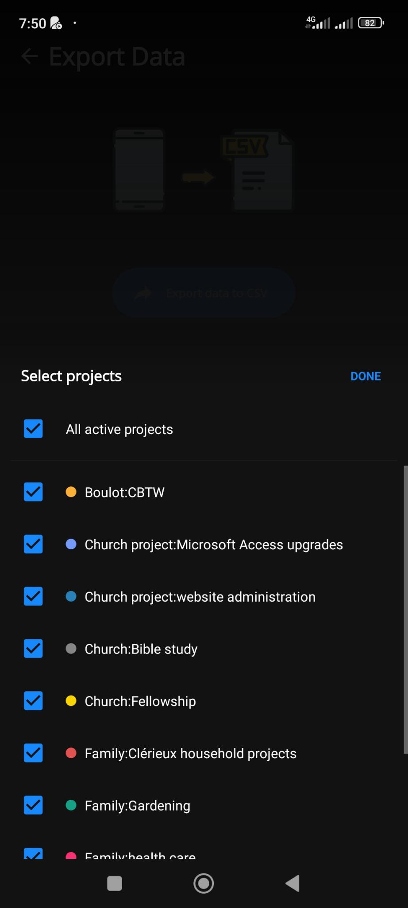

# The Export Projects Selection Modal

In this modal, we have:

- [] a fixed title "Select projects" and a button "DONE" to close the modal.
- [] a first item "All active projects" to include all active projects in the export.
- [] after a separator line, a list of all active projects
- [] after "Archived" link label, list all archived projects.
  - By default, those are not shown and require to click the label to toggle the projects.
- [] Each project is displayed with:
  - a checkbox, by default checked.
  - the tiny circle in the project's color
  - the project name.
