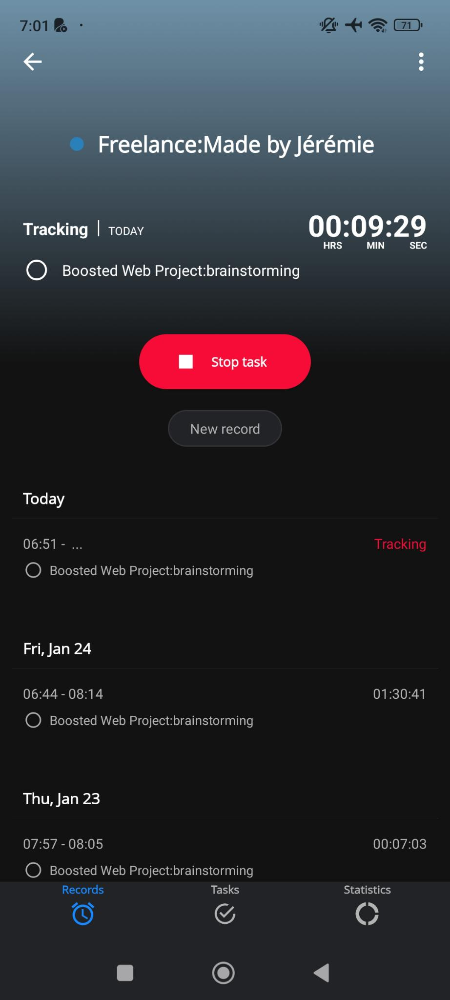

# Timeline Screen

- [ ] List all the records in chronological order with a grouping by date.
  - [ ] Grouping label is made of:
    - the day of the week in letters,
    - the day of the month,
    - the month in letters,
    - the year if the record's year is different from the current year.
- For each record not being tracked:
  - [ ] the project name in bold letters preceeded by a small circle of the project's color on its left
  - [ ] the task name is preceeded by a circle checkbox, empty if task is not completed, checked otherwise,
  - [ ] the time tracked,
  - [ ] the ability to start that task once again,
  - [ ] the ability to complete the task, if the record is linked to a task. It is not the case for a project.
- For a ongoing tracking,

  - [ ] A box with a background as a gradient based on the project's color.
  - [ ] the project name in bold letters
  - [ ] the task name is preceeded by a circle checkbox, empty if task is not completed, checked otherwise,
  - [ ] the time elapsed since start of tracking,
  - [ ] the ability to stop the record.
  - [ ] Tapping on the record being tracked, it brings the project's screen with task and or the project itself above a "Stop task" button.

  

  - [ ] Tapping on the current tracked record in "Today" section brings the [Record Being Tracked Screen](editing-a-record-being-tracked.md).

  - [ ] Tapping on any past tracked record brings the [Record Not Tracked Screen](editing-a-record-not-being-tracked.md).

- [ ] The list is grouped by date in chronological order.
- [ ] The top item is the current tracking.
- [ ] At the bottom, we have:
  - [ ] On the left side, a sandwitch menu icon. Clicking it brings up the [Bottom Menu Modal](bottom-menu-modal.md).
  - [ ] In the center, a button "Projects". See the [Project Selection Modal](project-selection-modal.md).
